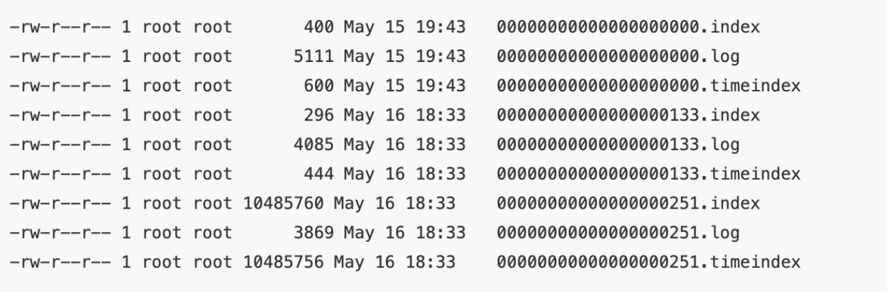
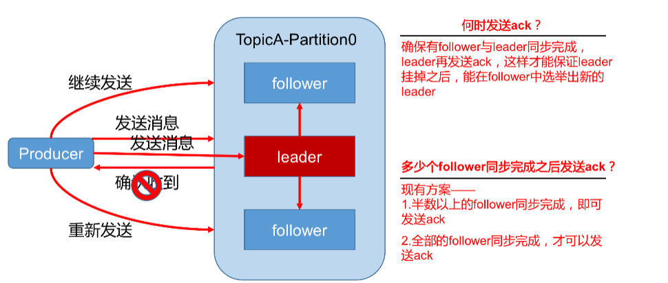
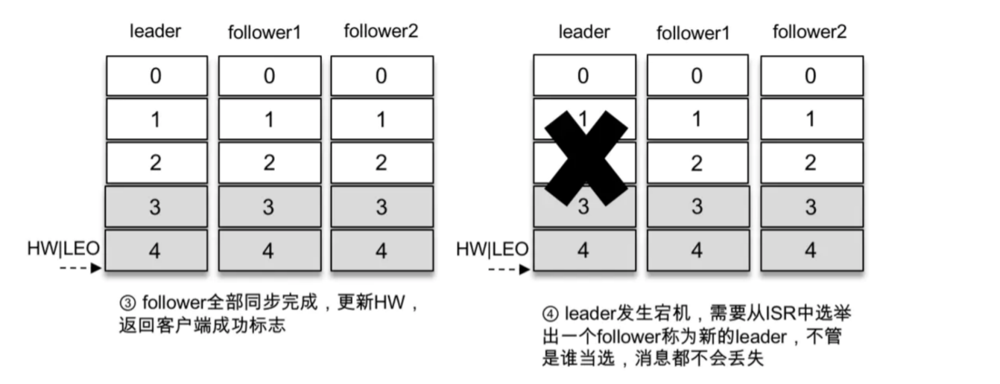

- [1. Java基础篇](#1-java基础篇)
  - [1.1 Java基础语法特性](#11-java基础语法特性)
  - [1.5 反射机制详解](#15-反射机制详解)
    - [1.5.1 什么是JAVA反射机制](#151-什么是java反射机制)
    - [1.5.2 反射提供了哪些功能](#152-反射提供了哪些功能)
    - [1.5.3 反射应用场景](#153-反射应用场景)
    - [1.5.4 反射原理](#154-反射原理)
    - [1.5.5 反射机制的优缺点](#155-反射机制的优缺点)
- [2. 集合篇](#2-集合篇)
  - [2.1 Map集合](#21-map集合)
  - [2.2 List集合](#22-list集合)
  - [2.3 Set集合](#23-set集合)
  - [2.4 Queue集合](#24-queue集合)
- [3. JVM篇](#3-jvm篇)
- [4. 设计模式篇](#4-设计模式篇)
- [5. 并发编程篇](#5-并发编程篇)
- [6. 网络基础篇](#6-网络基础篇)
- [7. 网络IO篇](#7-网络io篇)
- [8.操作系统篇](#8操作系统篇)
  - [8.1 Linux常用命令](#81-linux常用命令)
  - [8.2 shell编程](#82-shell编程)
- [9. Spring](#9-spring)
- [10. SpringBoot](#10-springboot)
- [11. Mybatis](#11-mybatis)
- [12. 开发基础框架](#12-开发基础框架)
  - [12.1  开发常用类库篇](#121--开发常用类库篇)
  - [12.2 开发单元测试篇](#122-开发单元测试篇)
  - [12.3 开发网络安全篇](#123-开发网络安全篇)
- [13. MYSQL](#13-mysql)
- [14. Redis](#14-redis)
- [15. Elasticsearch](#15-elasticsearch)
- [16. Netty与RPC](#16-netty与rpc)
- [17. Zookeeper](#17-zookeeper)
- [18. 分布式消息](#18-分布式消息)
  - [18.1 MQ选型](#181-mq选型)
  - [18.2 RocketMQ](#182-rocketmq)
    - [18.2.1 Producer怎么发送消息](#1821-producer怎么发送消息)
    - [18.2.2 消息存储](#1822-消息存储)
    - [18.2.3 Consumer怎么消费消息](#1823-consumer怎么消费消息)
    - [18.2.4 事务消息](#1824-事务消息)
    - [18.2.5 **消息重复**](#1825-消息重复)
    - [18.2.6 顺序消费](#1826-顺序消费)
    - [18.2.7 负载均衡](#1827-负载均衡)
  - [18.3 kafka](#183-kafka)
    - [18.3.1 Kafka 概念](#1831-kafka-概念)
    - [18.3.2 架构图](#1832-架构图)
    - [18.3.3 相关术语](#1833-相关术语)
    - [18.3.4 kafka特性分析](#1834-kafka特性分析)
      - [18.3.4.1 #消息存储](#18341-消息存储)
      - [18.3.4.2 #分区副本剖析](#18342-分区副本剖析)
      - [18.3.4.3 #可靠性ack分析](#18343-可靠性ack分析)
      - [18.3.4.4 #磁盘顺序读写](#18344-磁盘顺序读写)
      - [18.3.4.5 高性能页缓存（Page Cache）](#18345-高性能页缓存page-cache)
      - [18.3.4.6 零拷贝](#18346-零拷贝)
    - [18.3.5 kafka生产者](#1835-kafka生产者)
    - [18.3.6 kafka消费者](#1836-kafka消费者)
      - [18.3.6.1 消费方式](#18361-消费方式)
      - [18.3.6.2 重平衡](#18362-重平衡)
      - [18.3.6.3 分区分配策略](#18363-分区分配策略)
      - [18.3.6.4 offset维护](#18364-offset维护)
    - [18.3.7 常用命令](#1837-常用命令)
      - [查看topic列表](#查看topic列表)
      - [删除topic](#删除topic)
      - [发送消息](#发送消息)
      - [消费消息](#消费消息)
      - [查看某个topic详情](#查看某个topic详情)
      - [修改分区数](#修改分区数)
      - [查看kafka配置](#查看kafka配置)
    - [18.3.8 面试题](#1838-面试题)
      - [1） ISR解决什么问题？](#1-isr解决什么问题)
      - [2）消息积压怎么处理？](#2消息积压怎么处理)
- [四、分布式专题](#四分布式专题)
  - [1. 分布架构设计与演进](#1-分布架构设计与演进)
  - [2. 分布式通信框架](#2-分布式通信框架)
  - [3. 分布式协调服务](#3-分布式协调服务)
  - [4. 分布式服务治理](#4-分布式服务治理)
  - [5. 分布式消息](#5-分布式消息)
    - [RocketMQ](#rocketmq)
      - [Producer怎么发送消息](#producer怎么发送消息)
      - [消息存储](#消息存储)
      - [Consumer怎么消费消息](#consumer怎么消费消息)
      - [事务消息](#事务消息)
      - [**消息重复**](#消息重复)
      - [顺序消费](#顺序消费)
      - [负载均衡](#负载均衡)
    - [kafka](#kafka)
      - [架构图](#架构图)
      - [相关术语](#相关术语)
      - [kafka特性分析](#kafka特性分析)
      - [常用命令](#常用命令)
  - [6. 分布式缓存](#6-分布式缓存)
- [五、微服务专题](#五微服务专题)
- [六、运维专题](#六运维专题)
- [七、搜索专题](#七搜索专题)
- [八、大数据专题](#八大数据专题)
- [九、系统架构设计专题](#九系统架构设计专题)
- [十、数据结构与算法专题](#十数据结构与算法专题)
- [十一、部署与工具专题](#十一部署与工具专题)
- [十二、人工智能专题](#十二人工智能专题)

> 参考：https://github.com/idaSmilence/javaP7/blob/master/JAVA.md#%E4%B8%80%E5%9F%BA%E7%A1%80%E7%AF%87

# 1. Java基础篇

## 1.1 Java基础语法特性

Java equals()和hashCode()的作用

equals() 源码中默认就是通过 “==”来比较两个对象是否相等。在引用类型中，== 用来比较两个对象引用地址是否相同。

hashCode()用于获取对象的哈希码

默认情况下，比较两个对象

- equals()为true，那么hashCode相同
- equals()为false, 并不能确定hashCode是否相同
- hashCode()不相等，equals肯定为false
- hashCode相等，equals不能确认

主要原因就体现在hash表【散列表】的数据结构上，不同的值，通过hash算法，hash结果可能相同。

在Java中hash算法主要用在集合上，如hashset, hashmap

所以，set集合和hashmap的key是根据hashcode来判断对象是否相等的。

因此，在重写对象equals方法的同时，我们也需要重写hashCode

```java
public class UserInfo {
  private String name;
  private int age;

  @Override
  public boolean equals(Object o) {
    if (this == o) {
      return true;
    }
    if (o == null || getClass() != o.getClass()) {
      return false;
    }
    UserInfo userInfo = (UserInfo) o;
    return age == userInfo.age &&
        Objects.equals(name, userInfo.name);
  }

  @Override
  public int hashCode() {
    return Objects.hash(name, age);
  }

  @Override
  public String toString() {
    return "UserInfo{" +
        "name='" + name + '\'' +
        ", age=" + age +
        '}';
  }

  public String getName() {
    return name;
  }

  public void setName(String name) {
    this.name = name;
  }

  public int getAge() {
    return age;
  }

  public void setAge(int age) {
    this.age = age;
  }
}
```


## 1.5 反射机制详解

**目标**

1. 什么是Java反射机制？
2. 反射机制提供了哪些功能？
3. 反射机制应用场景
4. 反射机制的原理

### 1.5.1 什么是JAVA反射机制

JAVA反射机制是在运行状态中，对于任意一个类，都能够知道这个类的所有属性和方法；对于任意一个对象，都能够调用它的任意一个方法和属性；这种动态获取的信息以及动态调用对象的方法的功能称为java的反射机制。

### 1.5.2 反射提供了哪些功能

- 在运行时判定任意一个对象所属的类
- 在运行时构造任意一个类的对象
- 在运行时判定任意一个类所具有的成员变量和方法
- 在运行时调用任意一个对象的方法
- 生产动态代理

### 1.5.3 反射应用场景

- **逆向代码**-例如反编译
- **开发通用框架** - 反射最重要的用途就是开发各种通用框架。很多框架（比如 Spring）都是配置化的（比如通过 XML 文件配置 JavaBean、Filter 等），为了保证框架的通用性，需要根据配置文件运行时动态加载不同的对象或类，调用不同的方法。
- **动态代理** - 在切面编程（AOP）中，需要拦截特定的方法，通常，会选择动态处理方式。这时，就需要反射技术来实现
  - JDK动态代理： spring默认动态代理，需要实现接口
  - CGLIB：通过asm框架序列化字节流，可配置，性能查
- **自定义注解** - 注解本身仅仅是起到标记作用，它需要利用反射机制，根据主键标记去调用注解解释器，执行行为。
- **动态生成类的框架** -  例如 Gson
- **BeanUtil相关工具** - 例如 MapStruct

### 1.5.4 反射原理

反射首先是能够获取到Java中的反射类的字节码，然后将字节码中的方法、变量、构造函数等映射成响应的Method、Field、Constructor等类对象

以上只是核心知识点梳理，详细原理请看[反射机制详情](javabase/reflect.md)

### 1.5.5 反射机制的优缺点

**优点：**

运行期类型的判断（RTTI，Run-Time Type Identification），动态类加载，动态代理使用反射。

**缺点：**

性能是一个问题，反射相当于一系列解释操作，通知jvm要做的事情，性能比直接的Java代码要慢很多

**总结：**

Java的反射机制在平时的业务开发过程中使用频率较低，但是在一些基础框架的搭建上应用比较广泛，例如Spring框架中就使用了许多反射。

# 2. 集合篇

目标：整理各集合类型的特性以及底层数据结构

Java集合体系


## 2.1 Map集合

| Map类型               | 数据结构 | 有序性 | 可否为null                       | 是否同步 | 时间复杂度              |
| --------------------- | -------- | ------ | -------------------------------- | -------- | ----------------------- |
| HashMap               |          | 无序   | 允许一个key为null, value没有限制 | 否       | 插入O(1)，查找O(1)      |
| LinkedHashMap         |          |        |                                  |          | 插入O(1)，查找O(log(n)) |
| TreeMap               |          |        |                                  |          | 插入O(1)，查找O(log(n)) |
| HashTable             |          |        |                                  |          | 插入O(1),查找O(n²)      |
| ConcurrentHashMap     |          |        |                                  |          |                         |
| ConcurrentSkipListMap |          |        |                                  |          |                         |


## 2.2 List集合

## 2.3 Set集合

## 2.4 Queue集合

# 3. JVM篇

# 4. 设计模式篇

# 5. 并发编程篇

# 6. 网络基础篇

# 7. 网络IO篇

# 8.操作系统篇

## 8.1 Linux常用命令

## 8.2 shell编程

# 9. Spring

# 10. SpringBoot

# 11. Mybatis

# 12. 开发基础框架

## 12.1  开发常用类库篇

## 12.2 开发单元测试篇

## 12.3 开发网络安全篇

# 13. MYSQL

# 14. Redis

# 15. Elasticsearch

# 16. Netty与RPC

# 17. Zookeeper

# 18. 分布式消息

> 消息队列作为高并发系统的核心组件之一，能够帮助业务系统解构提升开发效率和稳定性。
>
> 作用：
>
> - 削峰填谷 （主要解决瞬时写压力大于应用服务能力导致消息丢失、系统奔溃等问题）
> - 异步处理，提升性能 （当存在一对多调用时，可以通过消息通知相关系统）
> - 蓄流压测（线上有些链路不好压测，可以通过堆积线上一定量消息再开放来压测）

## 18.1 MQ选型

⽬前主流的MQ主要是Rocketmq、kafka、Rabbitmq、paslur

**中小型公司**，技术实力较为一般，技术挑战不是特别高，用 **RabbitMQ** （开源、社区活跃）是不错的选择；**大型公司**，基础架构研发实力较强，用 **RocketMQ**（Java二次开发） 是很好的选择。

如果是**大数据领域**的实时计算、日志采集等场景，用 **Kafka** 是业内标准的，绝对没问题，社区活跃度很高，绝对不会黄，何况几乎是全世界这个领域的事实性规范。

|                        | RocketMQ                                                     | RabbitMQ                                                     | Kafka                                                        |
| ---------------------- | ------------------------------------------------------------ | ------------------------------------------------------------ | ------------------------------------------------------------ |
| 设计定位               | 非日志的可靠消息传输。例如：订单，交易，充值，流计算，消息推送，binlog分发等 |                                                              | 系统间的数据流管道，实时数据处理。例如常规消息系统，网络活性跟踪，监控数据收集，处理等 |
| 单机吞吐量             | 10W                                                          | 1w                                                           | 10w                                                          |
| 消息延迟               | 毫秒                                                         | 微秒                                                         | 毫秒                                                         |
| 消息丢失               | 参数优化后可以0丢失                                          | 可能性很低                                                   | 参数优化后可以0丢失                                          |
| 消息模式               | 推拉                                                         | 推拉                                                         | 拉取                                                         |
| 主题数量对吞吐量的影响 | 几百以上主题会对吞吐量有较小的影响                           | \                                                            | 几十上百个主题会极大影响吞吐量                               |
| 可用性                 | 很高 （主从）                                                | 高（主从）                                                   | 很高（分布式）                                               |
| 优点                   | 1. 在高吞吐、低延迟、高可用上有很好表现。消息堆积时，性能也很好<br>2.api设计更加适合业务处理的场景<br>3.支持多种消费方式<br>4.支持broker消息过滤<br>5.支持事务<br>6.支持顺序消费<br> | 1.轻量级，快速部署方便<br>2.支持灵活的路由配置。RabbitMQ中，在生产者和队列之间有一个交换器模块。根据配置的路由规则，生产者发送的消息可以发送到不同的队列中。路由规则很灵活，还可以自己实现。<br>3.客户端支持大多数编程语言，支持AMQP协议 | 1. 在高吞吐、低延迟、高可用、集群热扩展、容错上有非常好的表现<br/>2. producer端提供缓存、压缩功能，可节省性能，提高效率<br/>3. 提供顺序消费能力<br/>4.提供多种客户端语言<br/>5.生态完善，在大数据处理方面有大量配套设施 |
| 缺点                   |                                                              | 1.如果有大量消息堆积在队列中，性能会急剧下降<br>2. 每秒处理几万到几十万的消息<br>3.Erlang语言开发，功能扩展和二次开发代价高 | 1. 消费集群数目收到分区数目的限制<br>2.单机topic多时，性能会明显降低<br/>3.不支持事务 |


## 18.2 RocketMQ

**目标**

- 了解rocketMQ架构
- 了解Producer如何发送消息
- 消息怎么存储
- Consumer怎么消费消息
- 了解RocketMQ关键机制的设计原理
  - 消息存储
  - 通信机制
  - 消息过滤
  - 负载均衡
  - 事务消息
  - 顺序消费
  - 消息重复

> 关键机制的设计原理参考官方文档：https://github.com/apache/rocketmq/blob/master/docs/cn/design.md


### 18.2.1 Producer怎么发送消息

Producer与Name Server集群中某个节点（随机选择）建立长连接，定期获取topic路由信息。Producer轮询某topic下所有队列的方式来实现发送方的负载均衡。如图


### 18.2.2 消息存储

是由Comsume Queue和Commit Log配置完成的

### 18.2.3 Consumer怎么消费消息

有两种模式

**pull模式**：consumer端每隔一段时间主动像broker发送拉消息请求

**push模式**：本质也是拉模式，只是对pull模式的一种封装，与broker建立长连接，成功拉取到一批消息后，不会断开连接，而是继续向服务端拉取消息，如果broker收到pull消息后，消息队列中没有数据，broker会阻塞该请求，直到有数据或者超时才返回。

Consumer实现负责均衡：


consumer端会通过RebalanceService线程，10s做一次基于Topic下的所有队列负载：

1. 遍历consumer下所有的topic， 然后根据topic订阅所有的消息
2. 获取同一个topic和consume group下所有的consumer
3. 然后根据具体的分配策略来分配消费队列，分配的策略包含：平均分配、消费配置等。

如上图所示，topicTestA有8个队列，consume group中有两个consumer， 采用平均分配策略，各消费4个消费队列

### 18.2.4 事务消息

RocketMQ在4.3.0版本开始支持分布式事务消息。主要通过2PC思想来实现提交事务消息，同时增加了补偿逻辑来回查二阶段超时或者失败的消息


主要分为两个流程：正常事务操作、事务消息的补偿流程

- 正常事务流程：

  - 发送half消息，会拿到消息的地址，（此时half消息对业务不可见）
  - 执行本地事务
  - 根据本地事务状态执行commit或者rollback （commit操作生成对消费者可见的消息索引）

- 补偿逻辑流程：（解决消息commit 或者 rollback发生超时或者失败的情况）

  - 对没有 commit/ rollback的事务消息，从服务端发起一次 “回查”
  - Producer收到回查消息，检查回查消息对应的本地事务状态，重新commit/rollback

  注意：信息事务回查，默认是15次，超过15次，rocketmq默认回滚消息。

除了MQ的事务处理方式，可以通过增加本地事件表的方式来实现


### 18.2.5 **消息重复**

RocketMQ没有解决消息重复问题，因为会影响系统的吞吐量和高可用。

造成消息重复的根本原因是：网络不可达

那么问题就变成了：如果消费端收到两条一样的消息，该怎么处理？

答：保证在消息重发的时候，消费者不会重复处理。即使在**消费者收到重复消息的时候，重复处理**，也

要**保证最终结果的一致性**。所谓幂等性。

**如何实现？**

每条数据都有唯一的消息ID，利用一张日志表记录已经成功处理的消息ID，如果新到的消息ID在日志表中，则消费端就不处理这条消息。

> 幂等性：就是用户对于同一操作发起的一次或多次请求的结果是一致的，不会因为多次处理而产生副作用

**#幂等性解决方案**

在MQ中，是无法保证每个消息只被投递一次的，所以要在业务上自行保证消息消费的幂等性。而RocketMQ的每条消息都有一个唯一的MessageID，这个参数在多次投递的过程中是不会改变的，所以业务上可以用这个MessageID来作为判断幂等的关键依据。

但是，这个MessageID是无法保证全局唯一的，也会有冲突的情况。所以在一些对幂等性要求严格的场景下，最好是使用业务上唯一的一个标识比较靠谱。这个ID可以使用分布式中间件Redis，zk等生成。这个业务表示可以使用Message的key来进行传递。

同时，建立一张消息表，给消息做一个唯一索引约束，那么就算出现重复消费的情况，就不再处理这条消息。

### 18.2.6 顺序消费

- 全局顺序：对指定的一个topic，所有消息都严格按照先入先出的顺序发布和消费。会影响消息系统的吞吐量。适用场景：性能要求不高

  ```markdown
  执行严格全局顺序
  保证 Producer -> MQserver -> consumer是一对一关系
  
  注意 这样的设计⽅案问题：
  1.并⾏度会成为消息系统的瓶颈（吞吐量不够）
  2.产⽣更多的异常处理。⽐如：只要消费端出现问题，就会导致整个处理流程阻塞，我们不得不花费更多的
  精 ⼒来解决阻塞的问题。
  ```

  

- 分区顺序

  - 对于指定的一个 Topic，所有消息根据 sharding key 进行区块分区，保证在同一分区内是顺序消费的。适用场景：性能要求高

  ```markdown
  1. producer通过轮询topic的所有队列的方式来确定消息被发送到哪个队列 （负载均衡策略）
  2. 获取到路由信息后，会根据MessageQueueSelector实现的算法来选择⼀个队列，保证同一个OrderID获取到的肯定是同一个队列
  ```

### 18.2.7 负载均衡

RocketMQ的负载均衡都是在client端完成的。

- Producer端：通过轮序topic获取所有队列，在根据MessageQueueSelector实现的算法来选择一个队列
- Consumer端：对于同一topic下的所有队列，Consumer group下的所有Consumer，根据具体的分配策略来分配消费队列，分配的策略包含：平均分配、消费配置等。

## 18.3 kafka

### 18.3.1 Kafka 概念

kafka是一种高吞吐量、分布式、基于发布/订阅的消息系统，最初由LinkedIn公司开发，使用Scala语言编写，目前是Apache的开源项目。

### 18.3.2 架构图


### 18.3.3 相关术语

- **Producer**：生产者
- **consumer**： 消费者，一个consumer可以消费多个partition leader，一个partition leader只能被一个consumer 消费
- **consumer group**： 消费者组，多个消费者实例共同组成一个组，同时消费多个分区以实现高吞吐
  - 实现高吞吐
- **broker**： kafka服务器，负责消息存储和转发
- **Topic**：消息主题。是承载消息的逻辑容器。表示一类消息的集合，每个主题包含若干条消息，每条消息只能属于一个主题。在实际使用中多用来区分具体的业务。kafka是按照topic来分类消息的。
- **Partition**: topic分区，一个有序不变的消息序列。一个topic可以包含多个partition，topic消息保存在各个partition上
  - partition是kafka高吞吐量的一种体现
- **Offset**： 消息日志中的位置，可以理解是消息在partition上的偏移量，也是代表该消息的唯一序号。是一个单调递增且不变的值。
- **Replica**：partition的副本。kafka中同一条消息能够被拷贝到多个地方以提供数据冗余，这些地方就是所谓的副本。副本分为leader和follower，各自有不同的角色划分。副本是在分区层级下的，即每个分区可配置多个副本实现高可用
  - kafka实现高可用/高可靠性的一种手段
  - 一个分区可以有多个副本。每个分区可配置多个副本实现高可用，副本不可读写
- **consumer offset**： 消费者位移，表示消费者的消费进度，每个消费者都有自己的消费者位移。
- **Rebalance**： 重平衡。消费者组内某个消费者实例挂掉之后，其他消费者实例自动重新分配订阅主题分区的过程。
  - rebalance是kafa消费者端实现高可用的重要手段

### 18.3.4 kafka特性分析

#### 18.3.4.1 #消息存储

topic是一个逻辑概念，包含多个partition，partition是物理分区，分区可以在主题创建的时候指定，也可以在之后修改。每条消息在发送的时候会

根据分区规则被追加到指定的分区中，分区中的每条消息都会被分配⼀个唯⼀的序列号，也就是通常所

说的偏移量（offset）。


不考虑多副本的情况，⼀个分区对应⼀个⽇志（Log）。为了防⽌ Log 过⼤，Kafka ⼜引⼊了⽇志分段

（LogSegment）的概念，将 Log 切分为多个 LogSegment，相当于⼀个巨型⽂件被平均分配为多个相

对较⼩的⽂件，这样也便于消息的维护和清理。一个logSegment默认最大为1G。


向主题topic-log中发送⼀定量的消息，某⼀时刻topic-log-0⽬录中的布局：



kafka topic log目录命名规则？

topic名称+分区序号。例如，first这个topic有三个分区，则其对应的文件夹为first-0,first-1,first-2。

logSegment命名规则？

#### 18.3.4.2 #分区副本剖析

> 分区副本机制是kafka实现高可用的一种手段。

Kafka 通过多副本机制实现故障⾃动转移，在 Kafka 集群中某个 broker 节点失效的情况下仍然保证服

务可⽤。


我们该如何确保副本中所有的数据都是⼀致的呢？特别是对Kafka⽽⾔，当⽣产者发送消息到某个主题

后，消息是如何同步到对应的所有副本中的呢？针对这个问题，最常⻅的解决⽅案就是采⽤基于领导者

（Leader-based）的副本机制。


1. 副本分成两类， Leader Replica和Follower Replica。
2. follower是不对外提供服务的。也就是说，任何一个follower都不能响应消费者和生产者的读写请求。目的是容灾备份，保证高可用。所有的请求都必须由leader来处理。或者说所有的读写都必须发往leader所在的broker，由该broker负责处理。
3. 当leader挂掉了，或者说leader所在的broker宕机时，kafka依托于Zookeeper提供的监控功能能够实时感知，并开启新一轮的leader选举，从ISR中选举leader，当之前挂掉的leader重新上线后，只能作为follower加入到集群中。


**失效副本**

OSR, (Out-Sync Relipcas), 正常情况下，分区的所有副本都处于ISR集合中，但是难免会有异常情况发生，从而某些副本被移除ISR集合中。在ISR之外，也就是处于同步失效或者功能失效状态下的副本统称为失效副本。

**ISR机制**

ISR，（全称In-Sync Replicas）是指与leader保持同步状态的follwer集合。leader也属于ISR。

**AR机制**

AR: (Assigned Repllicas),分区中所有的副本都统称为AR。

原则上， AR = ISR + OSR


**LEO与HW**

LEO，（Log End Offset），日志末端偏移量

HW， （High Water）， 高水位

LEO标识每个分区中最后一条消息的下一个位置，分区的副本都有自己的LEO，ISR中最小的LEO即为HW，俗称高水位，消费者只能拉取到HW之前的消息。


#### 18.3.4.3 #可靠性ack分析

为了保证Producer发送的消息，能可靠的发送到topic指定的partition上，topic的partition收到Producer发送的消息后，都需要向Producer发送一个ack,如果producer收到ack,就会进行一轮消息发送，否则就会重新发送消息。



对于某些不太重要的数据，对数据的可靠性要求不是很高，能够容忍数据的少量丢失，所以没必要等ISR中的follower全部接收成功。

所以Kafka为用户提供了三种可靠性级别，用户根据对可靠性和延迟的要求进行权衡，选择以下的配置。

- **ack = 1**: ⽣产者将消息发送到 leader 副本，leader 副本在成功写⼊本地⽇志之后会

  告知⽣产者已经成功提交，如下图所示。如果此时 ISR 集合的 follower 副本还没来得及拉取到

  leader 中新写⼊的消息，leader 就宕机了，那么此次发送的消息就会丢失。

- **ack = 0 :** producer⽆需等待来⾃broker的确认⽽继续发送下⼀批消息。这种

  情况下数据传输效率最⾼，但是数据可靠性确是最低的。

- **ack = -1 ：**⽣产者将消息发送到 leader 副本，leader 副本在成功写⼊本地⽇志之后还

  要等待 ISR 中的 follower 副本全部同步完成才能够告知⽣产者已经成功提交，即使此时 leader 副

  本宕机，消息也不会丢失。

  

#### 18.3.4.4 #磁盘顺序读写

kafka采用磁盘顺序读写方式，极大提升了读写性能。

Kafka的producer生产数据，要写入到log文件中，写的过程是一直追加到文件末端，为顺序写。官网有数据表明，同样的磁盘，顺序写能到到600M/s，而随机写只有100k/s。这与磁盘的机械机构有关，顺序写之所以快，是因为其省去了大量磁头寻址的时间。

#### 18.3.4.5 高性能页缓存（Page Cache）

**优点：**

- I/O Scheduler 会将连续的小块写组装成大块的物理写从而提高性能
- I/O Scheduler 会尝试将一些写操作重新按顺序排好，从而减少磁盘头的移动时间
- 充分利用所有空闲内存（非 JVM 内存）。如果使用应用层 Cache（即 JVM 堆内存），会增加 GC 负担
- 读操作可直接在 Page Cache 内进行。如果消费和生产速度相当，甚至不需要通过物理磁盘（直接通过 Page Cache）交换数据
- 如果进程重启，JVM 内的 Cache 会失效，但 Page Cache 仍然可用

> 尽管持久化到Pagecache上可能会造成宕机丢失数据的情况，但这可以被Kafka的Replication机制解决。如果为了保证这种情况下数据不丢失而强制将 Page Cache 中的数据 Flush 到磁盘，反而会降低性能。

⼀般磁盘 I/O 的场景有以下四种：

\1. ⽤户调⽤标准 C 库进⾏ I/O 操作，数据流为：应⽤程序 buffer→C 库标准 IObuffer→⽂件系统⻚

缓存→通过具体⽂件系统到磁盘。

\2. ⽤户调⽤⽂件 I/O，数据流为：应⽤程序 buffer→⽂件系统⻚缓存→通过具体⽂件系统到磁盘。

\3. ⽤户打开⽂件时使⽤ O_DIRECT，绕过⻚缓存直接读写磁盘。

\4. ⽤户使⽤类似 dd ⼯具，并使⽤ direct 参数，绕过系统 cache与⽂件系统直接写磁盘。


#### 18.3.4.6 零拷贝

所谓的零拷⻉是指将数据直接从磁盘⽂件复制到⽹卡设备中，⽽不需要经由应⽤程序之⼿。零拷⻉⼤⼤

提⾼了应⽤程序的性能，减少了内核和⽤户模式之间的上下⽂切换。


### 18.3.5 kafka生产者

### 18.3.6 kafka消费者

#### 18.3.6.1 消费方式

consumer采用pull（拉）模式从broker中读取数据。

push（推）模式很难适应消费速率不同的消费者，因为消息发送速率是由broker决定的。它的目标是尽可能以最快速度传递消息，但是这样很容易造成consumer来不及处理消息，典型的表现就是拒绝服务以及网络拥塞。而pull模式则可以根据consumer的消费能力以适当的速率消费消息。

pull模式不足之处是，如果kafka没有数据，消费者可能会陷入循环中，一直返回空数据。针对这一点，Kafka的消费者在消费数据时会传入一个时长参数timeout，如果当前没有数据可供消费，consumer会等待一段时间之后再返回，这段时长即为timeout。

#### 18.3.6.2 重平衡

**什么情况下会发生重平衡？**

- consumer发生变化
- partition发生变化
- topic数量发生变化

**重平衡的详细过程：**


#### 18.3.6.3 分区分配策略

> 参考：https://www.cnblogs.com/chenxiaoge/p/13335416.html

一个consumer group中有多个consumer，一个 topic有多个partition，所以必然会涉及到partition的分配问题，即确定那个partition由哪个consumer来消费。

Kafka有三种分配策略，roundrobin，range，StickyAssignor

- **range** : 默认策略, Range是**对每个Topic而言**的（即一个Topic一个Topic分），首先对同一个Topic里面的分区按照序号进行排序，并对消费者按照字母顺序进行排序。然后用Partitions分区的个数除以消费者线程的总数来决定每个消费者线程消费几个分区。如果除不尽，那么前面几个消费者线程将会多消费一个分区。
- **round robin** : RoundRobinAssignor策略的原理是将消费组内所有消费者以及消费者所订阅的所有topic的partition按照字典序排序，然后通过轮询方式逐个将分区以此分配给每个消费者。
- **stickyAssignor**

#### 18.3.6.4 offset维护

由于consumer在消费过程中可能会出现断电宕机等故障，consumer恢复后，需要从故障前的位置的继续消费，所以consumer需要实时记录自己消费到了哪个offset，以便故障恢复后继续消费。

Kafka 0.9版本之前，consumer默认将offset保存在Zookeeper中，从0.9版本开始，consumer默认将offset保存在Kafka一个内置的topic中，该topic为***\*_\*******\*_consumer_offsets\****。

### 18.3.7 kafka事务


### 18.3.8 常用命令

#### 查看topic列表

```
./kafka-topics.sh --zookeeper 127.0.0.1:2181 --list
```

创建topic

```
bin/kafka-topics.sh --zookeeper hadoop102:2181 \
--create --replication-factor 3 --partitions 1 --topic first
```

选项说明：

--topic 定义topic名

--replication-factor  定义副本数

--partitions  定义分区数


#### 删除topic

```
bin/kafka-topics.sh --zookeeper hadoop102:2181 \
--delete --topic first
```

需要server.properties中设置delete.topic.enable=true否则只是标记删除

#### 发送消息

```
bin/kafka-console-producer.sh \
--broker-list hadoop102:9092 --topic first
>hello world
>atguigu  atguigu
```

#### 消费消息

```
bin/kafka-console-consumer.sh \
--bootstrap-server hadoop102:9092 --from-beginning --topic first

[atguigu@hadoop103 kafka]$ bin/kafka-console-consumer.sh \
--bootstrap-server hadoop102:9092 --from-beginning --topic first
```

--from-beginning：会把主题中以往所有的数据都读取出来。

#### 查看某个topic详情

```
bin/kafka-topics.sh --zookeeper hadoop102:2181 \
--describe --topic first
```

#### 修改分区数

```
bin/kafka-topics.sh --zookeeper hadoop102:2181 --alter --topic first --partitions 6
```

#### 查看kafka配置

```
./kafka-configs.sh --zookeeper 127.0.0.1:2181 --entity-type brokers --entitydefault --describe
```


### 18.3.8 面试题

#### 1） ISR解决什么问题？

设想以下情景：leader收到数据，所有follower都开始同步数据，但有一个follower，因为某种故障，迟迟不能与leader进行同步，那leader就要一直等下去，直到它完成同步，才能发送ack。这个问题怎么解决呢？

​	Leader维护了一个动态的in-sync replica set (ISR)，意为和leader保持同步的follower集合。当ISR中的follower完成数据的同步之后，leader就会给producer发送ack。如果follower长时间未向leader同步数据，则该follower将被踢出ISR，该时间阈值由***\*replica.lag.time.max.ms\****参数设定。Leader发生故障之后，就会从ISR中选举新的leader。

#### 2）消息积压怎么处理？

答： 出现消息积压的情况主要是生产能力高于消费能力，解决方案，扩容消费机器，或者对生产限流


# 19. dubbo

> 目标：
>
> 1. 为什么要使用dubbo， dubbo的作用
> 2. 怎么使用dubbo
> 3. dubbo的架构设计
> 4. dubbo的相关特性
> 5. 一致性哈希
> 6. dubbo的相关面试题
> 7. 源码分析？

普通哈希与一致性哈希


# 20.分布式专题

## 分布式事务及实现方案

### 基础知识

事务的ACID属性

分布式事务产生的场景

CAP理论

BASE理论

解决方案


# 21.微服务专题

# 22.运维专题

# 23.搜索专题

# 24.大数据专题

# 25.系统架构设计专题

# 26.数据结构与算法专题

# 27.部署与工具专题

# 28.人工智能专题

# 29. 一致性算法

# 30. java算法

# 31. 数据结构

