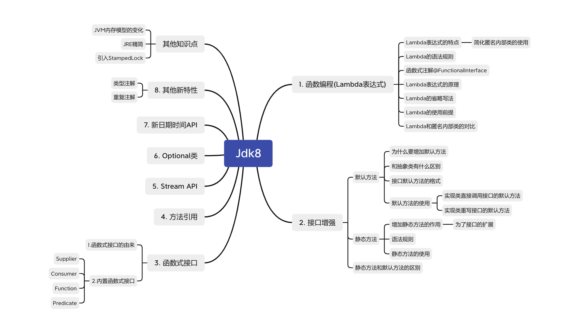
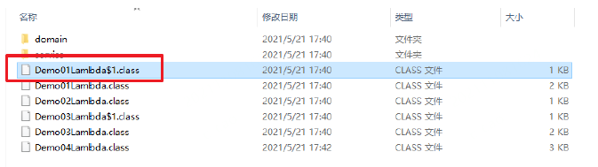
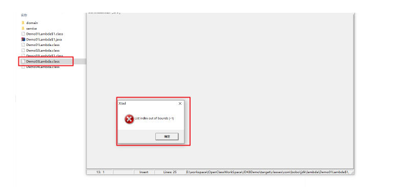
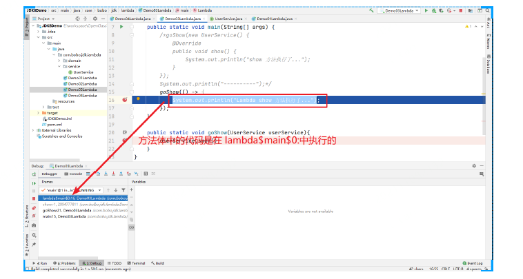
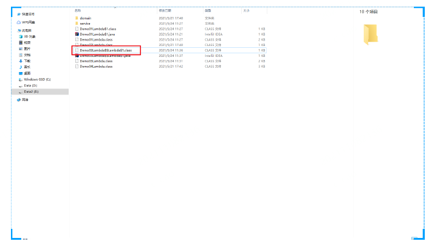
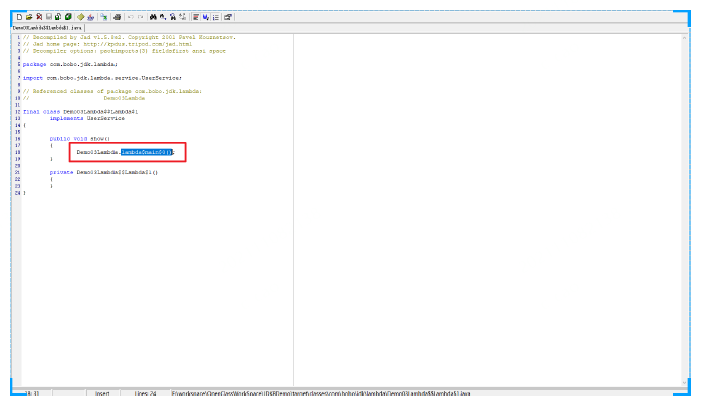

# java8特性知识体系详解

## 一、知识体系



## 二、函数式编程（Lambda表达式）

> 函数式编程是对行为进行抽象。可以简化匿名内部类的使用。
>
> 学习目标：
>
> 1. 了解Lambda的使用背景
> 2. 语法规则
> 3. 函数式接口@FunctionalInterface注解
> 4. Lambda表达式的原理
> 5. Lambda的省略写法
> 6. Lambda的使用前提
> 7. Lambda和匿名内部类的对比

### 1. Lambda的使用背景

场景分析，在java8之前，创建一个新的线程，指定线程要执行的任务的一种写法

```java
public static void main(String[] args){
    // 开启一个新的线程
    new Thread(new Runnable(){
        @Override
        public void run() {
        	System.out.println("新线程中执行的代码 :
        "+Thread.currentThread().getName());
        }
    }).start();
    System.out.println("主线程中的代码：" + Thread.currentThread().getName());
}
```

代码分析：

1. Thread类需要指定一个Runnable接口作为参数，其中的抽象方法run方法是用来指定线程任务内部的核心
2. 为了指定run方法体，不得不需要Runnable的实现类
3. 为了省去定位一个Runnable的实现类，不得不使用匿名内部类
4. 必须覆盖重写urn方法，所有的方法名称，方法参数，方法返回值都需要重写一遍，而且不能出错
5. 而实际上，我们只在乎方法体中的代码。2

### 2. Lambda表达式的体验

java8， Lambda表达式能简化上述匿名内部类的写法。

```java
new Thread(()-{
    System.out.println("新线程中执行的代码 :
        "+Thread.currentThread().getName());
}).start();
```

Lambda表达式的优点：简化了匿名内部类的使用，语法更简单。只需要关注方法体中的实现。

### 3. Lambda的语法规则

Lambda省去了面向对象的复杂限制，Lambda的标准格式由3个部分组成；参数类型，参数名称，代码体

```java
(参数类型 参数名称) -> {
	代码体;
}
```

格式说明：

- (参数类型 参数名称):参数列表
- {代码体;} :方法体
- -> : 箭头，分割参数列表和方法体

#### 3.1 Lambda练习

练习无参数返回值的Lambda

定义一个接口

```java
public interface UserService{
    void show();
}
```

使用

```java
public class Demo{
    public static void main(String[] args){
        goShow(()-{
            System.out.println("show 方法执行了..........");
        });
        System.out.println("----------");
		goShow(() -> { System.out.println("Lambda show 方法执行了..."); });
    }
    
    public static void goShow(UserService userService){
        userService.show();
    }
}
```

输出：

```text
show 方法执行了...
----------
Lambda show 方法执行了...
```

#### 3.2 Lambda练习2

完成一个有参且有返回值的Lambda表达式案例

创建一个Person对象

```java
@Data
@AllArgsConstructor
@NoArgsConstructor
public class Person {
    private String name;
    private Integer age;
    private Integer height;
}
```

然后我们在List集合中保存多个Person对象，然后对这些对象做根据age排序操作

```java
public static void main(String[] args){
    List<Person> list = new ArrayList<>();
    list.add(new Person("周杰伦",33,175));
    list.add(new Person("刘德华",43,185));
    list.add(new Person("周星驰",38,177));
    list.add(new Person("郭富城",23,170));
    Collections.sort(list, new Comparator<Person>() {
        @Override
        public int compare(Person o1, Person o2) {
        return o1.getAge()-o2.getAge();
        }
    });
    for(Person person : list){
        System.out.println(person);
    }
}
```


我们发现sort方法的第二个参数是一个Comparator接口，并且执行的方法是有参数和返回值的，那么我们可以改写成Lambda表达式

```java
public static void main(String[] args) {
    List<Person> list = new ArrayList<>();
    list.add(new Person("周杰伦",33,175));
    list.add(new Person("刘德华",43,185));
    list.add(new Person("周星驰",38,177));
    list.add(new Person("郭富城",23,170));
    /*Collections.sort(list, new Comparator<Person>() {
    @Override
    public int compare(Person o1, Person o2) {
    return o1.getAge()-o2.getAge();
    }
    });
    for (Person person : list) {
    System.out.println(person);
    }*/
    System.out.println("------");
    Collections.sort(list,(Person o1,Person o2) -> {
    	return o1.getAge() - o2.getAge();
    });
    for (Person person : list) {
   		System.out.println(person);
    }
}
```

输出结果：

```text
Person(name=郭富城, age=23, height=170)
Person(name=周杰伦, age=33, height=175)
Person(name=周星驰, age=38, height=177)
Person(name=刘德华, age=43, height=185)
```

### 4. @FunctionalInterface注解

```java
/**
* @FunctionalInterface
* 这是一个标志注解，被该注解修饰的接口只能声明一个抽象方法
*/
@FunctionalInterface
public interface UserService {
	void show();
}
```

### 5. Lambda表达式的原理

匿名内部类的本职是在编译时生产一个.class文件。 例如XXX$1.class

```java
public class Demo01Lambda {
	public static void main(String[] args) {
        // 开启一个新的线程
        new Thread(new Runnable() {
        @Override
        public void run() {
            System.out.println("新线程中执行的代码 :
            "+Thread.currentThread().getName());
            }
        }).start();
        System.out.println("主线程中的代码：" + Thread.currentThread().getName());
        System.out.println("---------------");
        /*new Thread(() -> { System.out.println("新线程Lambda表达式..."
        +Thread.currentThread().getName()); })
        .start();*/
    }
}
```



还可以通过反编译工具来查看生产的代码 XJad工具来查看

```java
static class Demo01Lambda$1 implements Runnable
{
    public void run()
    {
    System.out.println((new StringBuilder()).append("新线程中执行的代码 : "
    ).append(Thread.currentThread().getName()).toString());
    }
    Demo01Lambda$1()
    {
    }
}
```

那么Lambda表达式的原理是什么呢？我们也可以通过反编译工具来查看



写的有Lambda表达式的class文件，通过XJad查看报错，这时我们可以通过JDK自带的一个工具，javap对字节码进行反汇编操作。

```shell
javap -c -p 文件名.class
-c:表示对代码进行反汇编
-p:显示所有的类和成员
```

反汇编结果:

```shell
E:\workspace\OpenClassWorkSpace\JDK8Demo\target\classes\com\bobo\jdk\lambda>javap
-c -p Demo03Lambda.class
Compiled from "Demo03Lambda.java"
public class com.bobo.jdk.lambda.Demo03Lambda {
public com.bobo.jdk.lambda.Demo03Lambda();
Code:
0: aload_0
1: invokespecial #1 // Method java/lang/Object."<init>":
()V
4: return
public static void main(java.lang.String[]);
Code:
0: invokedynamic #2, 0 // InvokeDynamic #0:show:
()Lcom/bobo/jdk/lambda/service/UserService;
5: invokestatic #3 // Method goShow:
(Lcom/bobo/jdk/lambda/service/UserService;)V
8: return
public static void goShow(com.bobo.jdk.lambda.service.UserService);
Code:
0: aload_0
1: invokeinterface #4, 1 // InterfaceMethod
com/bobo/jdk/lambda/service/UserService.show:()V
6: return
private static void lambda$main$0();
Code:
    0: getstatic #5 // Field
java/lang/System.out:Ljava/io/PrintStream;
3: ldc #6 // String Lambda show 方法执行了...
5: invokevirtual #7 // Method
java/io/PrintStream.println:(Ljava/lang/String;)V
8: return
}
```

在这个反编译的源码中我们看到一个静态方法lambda$main$0(), 这个方法里面做了什么事情呢？我们通过debug的方式来查看下：



上面的效果可以理解如下：

```java
public class Demo03Lambda {
    public static void main(String[] args) {
    ....
    }
    private static void lambda$main$0();
	    System.out.println("Lambda show 方法执行了...");
    }
}
```

为了更加直观的理解这个内容，我们可以在运行的时候添加`Djdk.internal.lambda.dumpProxyClasses`,加上这个参数会将内部class码输出到一个文件中

```shell
java -Djdk.internal.lambda.dumpProxyClasses 要运行的包名.类名
```

命令执行结果：

```text
E:\workspace\OpenClassWorkSpace\JDK8Demo\target\classes>java -
Djdk.internal.lambda.dumpProxyClasses com.bobo.jdk.lambda.Demo03Lambda
Lambda show 方法执行了...
```



反编译后：



可以看到这个匿名内部类实现了UserService接口，并且重写了show()方法。在show方法中调用了Demo03Lambda.lambda$main$0(),也就是调用了Lambda中的内容。


小结：

1. 匿名内部类在编译的时候会生成一个class文件
2. Lambda表达式在程序运行的时候生成一个类
   1. 在这个类中新增一个方法，这个方法的方法体就是Lambda表达式中的代码
   2. 还会生成一个匿名内部类，实现接口，重写抽象方法
   3. 在接口中重写方法会调用新生成的方法

### 6.Lambda的省略写法

在Lambda表达式的标准写法基础上，可以使用省略写法，规则如下：

1. 小括号内的参数类型可以省略
2. 如果小括号内只有一个参数，则小括号可以省略
3. 如果大括号只有一条语句，可以同时省略大括号，return关键字和语句分号也可以省略

### 7. Lambda的使用前提

Lambda表达式的语法是非常简洁的，但是Lambda表达式不是随便使用的，使用时有几个条件要特别注意

1. 方法的参数或局部变量类型必须为接口才能使用Lambda
2. 接口中有且仅有一个抽象方法(@FunctionalInterface)

### 8. Lambda和匿名内部类的对比

- 所需类型不一样
  - 匿名内部类的类型可以是类，抽象类，接口
  - Lambda表达式需要的类型必须是接口
- 抽象方法的数量不一样
  - 匿名内部类所需的接口中的抽象方法数量不限制
  - Lambda表达式所需的接口有且仅有一个抽象方法
- 实现原理不一样
  - 匿名内部类是在编译后形成一个class
  - Lambda表达式是在程序运行的时候动态生成的class

## 三、接口增强

### 1. Java8中接口的新增

java8之前

```java
interface 接口名{
    静态常量;
    抽象方法;
}
```

java8做了增强，接口中增加了默认方法和静态方法

```java
interface 接口名{
    静态常量;
    抽象方法;
    默认方法;
    静态方法;
}
```

### 2. 默认方法

#### 2.1 为什么要增加默认方法

在java8之前，接口中只能有抽象方法和静态常量，会存在以下的问题：

如果接口中新增抽象方法，那么实现类都必须要实现这个抽象方法，非常不利于接口的扩展

#### 2.2 接口默认方法的格式

```java
interface 接口名{
    修饰符 default 返回值类型 方法名{
        方法体;
    }
}
```

例如：

```java
interface UserService{
    default String test(){
        return "hello world";
    }
}
```


#### 2.3 接口中的默认方法的使用

接口中的默认方法有两种格式

1. 实现类直接调用接口的默认方法
2. 实现类重写接口的默认方法

### 3. 静态方法

> java8中为接口新增的静态方法，作用也是为了接口的扩展

#### 3.1 语法

```java
interface 接口名{
    修饰符 static 返回值类型 方法名{
        方法体;
    }
}
```

#### 3.2 使用

```java
interface A{
    static String test(){
        return "hello world";
    }
}

public class Demo{
    public static void main(String[] args){
        A.test();
    }
}
```

接口中的静态方法在实现类中是不能被重写的，调用的话只能通过接口类型来实现， `接口名：静态方法名()`

### 4. 静态方法和默认方法的区别

1. 默认方法通过实例调用，静态方法通过接口名调用
2. 默认方法可以被继承，也可以被重写
3. 静态方法不能被继承

## 四、函数式接口

### 1. 函数式接口的由来

### 2. JDK封装的常用函数式接口

#### 2.1 Supplier

#### 2.2 Consumer

#### 2.3 Function

#### 2.4 Predicate

## 五、方法引用

### 1. 为什么要用方法引用

### 2. 方法引用的格式

## 六、Stream API

## 七、Optional类

## 八、新时间日期API

## 九、其他新特性