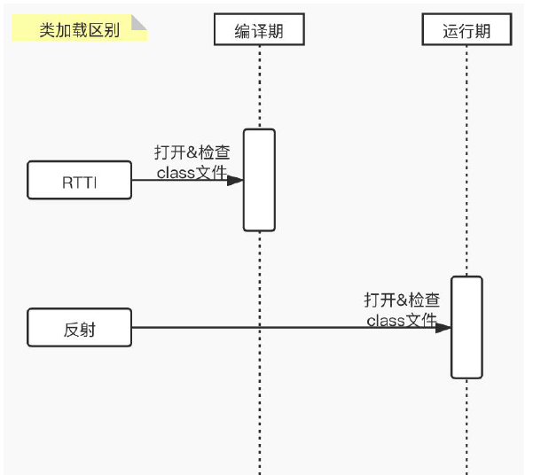
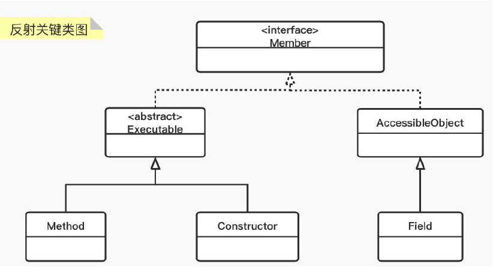
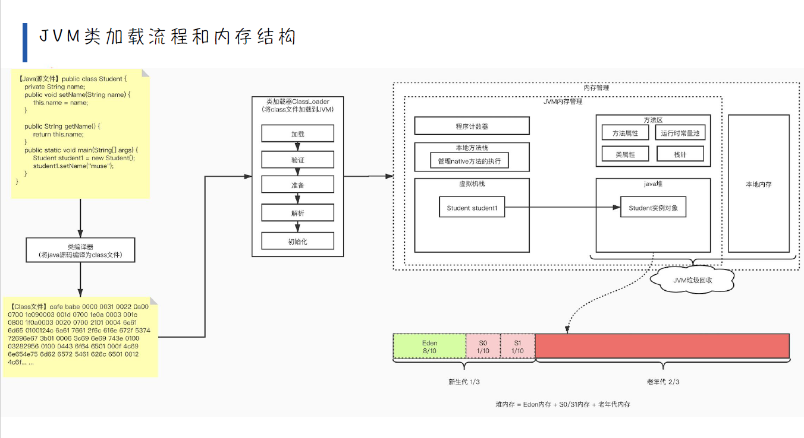
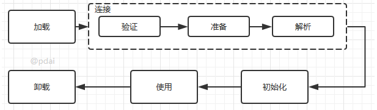
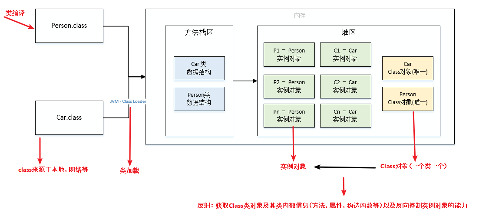

# Java反射机制详解

> JAVA反射机制是在运行状态中，对于任意一个类，都能够知道这个类的所有属性和方法；对于任意一个对象，都能够调用它的任意一个方法和属性；这种动态获取的信息以及动态调用对象的方法的功能称为Java语言的反射机制。Java反射机制在框架设计中极为广泛，需要深入理解。

## 反射基础

RTTI（Run-Time Type Identification）运行时类型识别。在《Thinking in Java》一书第十四章中有提到，其作用是在运行时识别一个对象的类型和类的信息。主要有两种方式：一种是“传统的”RTTI，它假定我们在编译时已经知道了所有的类型；另一种是“反射”机制，它允许我们在运行时发现和使用类的信息。



反射就是把Java类中的各种成分映射成一个个的Java对象

例如：一个类有：成员变量、方法、构造方法、包等等信息，利用反射技术可以对一个类进行解剖，把个个组成部分映射成一个个对象。



> 所以，我们首先需要理解Class类以及类的加载机制；然后基于此我们如何通过反射获取Class类以及类中的成员变量、成员方法和构造方法等。

### Class类

源代码通过编译器编译为字节码，再通过类加载子系统加载到JVM中，生成对应的Class对象。所有的数据类型，包括基本数据类型和关键字void同样表现为Class对象。这也说明了在Java中一切皆为对象。



所以，从中我们可以得到一下几点信息：

- class字节码加载到JVM中，会生成对应的Class对象
- Class类也是类的一种，与Class关键字是不一样的。
- 手动编写的类被编译后会产生一个Class对象，其表示的是创建类的类型信息
- 每个通过关键字class标识的类，在内存中有且只有一个与之对应的Class对象来描述其类型信息，无论创建多少个实例对象，其依据的都是用的同一个Class对象。（这里说明每个类的Class对象也是单例的）
- Class类只存私有构造函数，因此对应Class对象只能有JVM创建和加载
- Class类的对象作用是允许时提供或获取某个对象的类型信息，这点对于反射技术很重要。

### 类加载流程

回顾一下类加载流程，源代码经过编译成class字节码后，类加载子系统通过 **加载 -> 链接 -> 初始化 -> 使用 -> 卸载**



对上图类加载流程和内存结构的简化版



## 反射的使用

### Class对象的获取

获取class对象的三种方式

- 根据类名：类名.class
- 根据对象：对象.getClass()
- 根据全限定类名：Class.forName(全限定类名)

```java
	/**
     * 示例：创建Class对象的3种方式
     */
    @Test
    public void test() throws Throwable{
        // 方式一  类.class
        Class personClazz = Person.class;

        // 方式二  实例.getClass()
        Person person = new Person();
        Class personClazz1 = person.getClass();

        // 方式三  Class.forName("类的全路径")
        Class personClazz2 = Class.forName("com.muse.reflect.Person");

        System.out.println(personClazz == personClazz1);

        System.out.println(personClazz == personClazz2);
    }
```

## 反射机制的执行流程

## 反射机制的使用实战

## 参考文章

- https://pdai.tech/md/java/basic/java-basic-x-reflection.html#%E5%8F%8D%E5%B0%84%E5%9F%BA%E7%A1%80
- https://www.cnblogs.com/whoislcj/p/6038511.html

